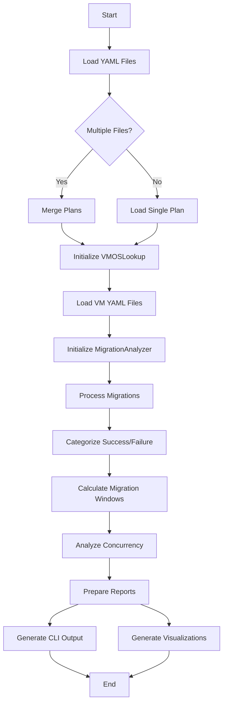
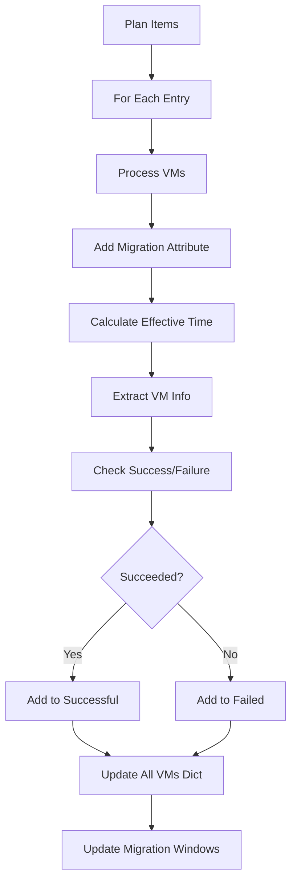
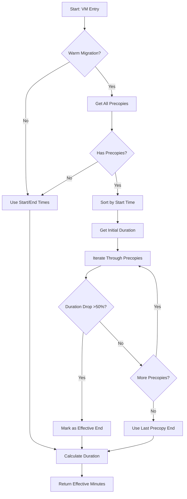

# MTV Parser - Developer Documentation

This document provides technical details about the MTV Parser codebase, architecture, and development workflows.

## Table of Contents

- [Architecture Overview](#architecture-overview)
- [Module Structure](#module-structure)
- [Code Flow](#code-flow)
- [Key Classes and Methods](#key-classes-and-methods)
- [Data Structures](#data-structures)
- [Algorithms](#algorithms)
- [Development Setup](#development-setup)
- [Testing](#testing)

## Architecture Overview

MTV Parser follows a modular architecture with clear separation of concerns:

```
┌─────────────────┐
│  mtv_plan_parser│  ← Entry point, orchestration
└────────┬────────┘
         │
    ┌────┴────┬──────────┬──────────┐
    ▼         ▼          ▼          ▼
┌─────────┐ ┌────────┐ ┌────────┐ ┌──────────┐
│Migration│ │CLI     │ │Visual- │ │VMOSLookup│
│Analyzer │ │Output  │ │ization │ │          │
└─────────┘ └────────┘ └────────┘ └──────────┘
    │
    └─► VMInformation (data class)
```

## Module Structure

### `mtv_plan_parser.py`

**Purpose:** Main entry point and workflow orchestration

**Key Functions:**

- `main()` - Orchestrates the entire analysis workflow
- `load_multiple_plans(directory)` - Loads and merges multiple MTV plan files

**Responsibilities:**

- Load YAML data from single or multiple files
- Initialize MigrationAnalyzer with OS lookup data
- Process migration success/failure information
- Calculate and organize migration windows
- Generate reports and visualizations

**Data Flow:**

```
YAML Files → load_multiple_plans() → MigrationAnalyzer
                                          ↓
                                   Process migrations
                                          ↓
                            ┌─────────────┴─────────────┐
                            ↓                           ↓
                      CLIOutput reports          Visualizations
```

### `migration_information.py`

**Purpose:** Core analysis engine containing the `MigrationAnalyzer` class

**Class:** `MigrationAnalyzer`

**Key Attributes:**

- `os_lookup` (Dict[str, str]) - Optional OS lookup dictionary from VM/VMI YAML files

**Core Methods:** See [Key Classes and Methods](#key-classes-and-methods) section

**Responsibilities:**

- Calculate effective migration times using precopy analysis
- Extract VM information from migration plans
- Analyze concurrent migrations
- Track migration success/failure
- Calculate aggregate statistics

### `vm_information.py`

**Purpose:** Data class for VM information storage

**Note:** This module defines the structure for VM data used throughout the analysis.

### `vm_os_lookup.py`

**Purpose:** Enhanced OS detection from VM/VMI YAML files

**Class:** `VMOSLookup`

**Key Methods:**

- `load_vm_yaml_files()` - Loads VM/VMI YAML files from directory
- `get_lookup()` - Returns dictionary mapping VM names to OS information

**Responsibilities:**

- Parse VM and VMI YAML files to extract OS information
- Provide fallback OS detection when migration plan data is insufficient
- Support enhanced OS reporting

### `clioutput.py`

**Purpose:** Format and display results to the command line

**Class:** `CLIOutput`

**Key Methods:**

- `migration_output(report_data, status, include_main_header)` - Generates migration reports
- `operating_system_report(all_vms)` - Creates OS breakdown reports
- `generate_concurrency_report(concurrency_data)` - Produces concurrency analysis
- `vm_migration_output(vm_summary)` - Generates VM-level statistics

**Responsibilities:**

- Format data into readable reports
- Handle tabular output using the `tabulate` library
- Write output to stdout or file

### `visualization.py`

**Purpose:** Create Gantt charts for migration timelines

**Key Functions:**

- `plot_gantt_chart(data)` - Creates and saves Gantt chart visualization

**Responsibilities:**

- Generate visual timeline of VM migrations
- Color-code by OS type
- Save charts as PNG files

## Code Flow

### Main Execution Flow



### Migration Processing Flow



### Effective Migration Time Calculation



## Key Classes and Methods

### MigrationAnalyzer Class

#### `__init__(self, os_lookup: Optional[Dict[str, str]] = None)`

Initializes the analyzer with optional OS lookup dictionary.

**Parameters:**

- `os_lookup` - Dictionary mapping VM names to OS information from VMI/VM YAML files

#### `calculate_effective_migration_time(vm, entry) -> float`

Analyzes precopy phases to determine effective migration completion time.

**Algorithm:**

1. Check if migration is warm (has precopies)
2. Sort all precopies by start time
3. Get initial precopy duration as baseline
4. Iterate through subsequent precopies
5. Detect significant drop (>50%) in duration
6. Calculate time from first precopy to drop point
7. Fallback to total migration time if no drop detected

**Parameters:**

- `vm` (Dict[str, Any]) - VM information including precopy details
- `entry` (Dict[str, Any]) - Migration entry with status and timing

**Returns:**

- float - Effective migration time in minutes

**Why This Matters:**
MTV tracks total time until manual cutover, which can be hours after data transfer completes. This method estimates when the migration was actually ready for cutover by detecting when precopy durations drop significantly, indicating data sync completion.

#### `extract_vm_information(vm, effective_duration) -> Dict`

Extracts essential VM data including OS, disk size, and transfer times.

**Parameters:**

- `vm` (Dict[str, Any]) - VM dictionary from migration plan
- `effective_duration` (float) - Effective duration in minutes

**Returns:**

- Dictionary containing:
  - `name` - VM name
  - `disk_size` - Total disk size in bytes
  - `start_time` - Transfer start timestamp
  - `duration` - Transfer duration in minutes
  - `migration_type` - "warm" or "cold"
  - `migration_window` - List of hourly timestamps

#### `analyze_concurrent_migrations(migration_plan_by_hour, max_concurrent_total, peak_time) -> Dict`

Analyzes concurrency patterns across migration windows.

**Parameters:**

- `migration_plan_by_hour` (datetime) - Hourly migration plan data
- `max_concurrent_total` (int) - Maximum concurrent VMs observed
- `peak_time` (datetime) - Time of peak concurrency

**Returns:**

- Dictionary containing:
  - `max_concurrent_total` - Peak concurrent VMs
  - `peak_time` - When peak occurred
  - `average_concurrent_vms` - Average per migration window
  - `overall_average_concurrent_vms` - Weighted average across all windows
  - `hourly_concurrent_vms` - Hour-by-hour breakdown

**Algorithm:**

- Calculates weighted average: `total_vm_hours / total_hours`
- Only counts active migration hours (excludes zero-VM hours)
- Rounds up to nearest integer for capacity planning

#### `get_migration_success_info(mtv_plan_data, all_vms) -> tuple`

Main processing method that extracts all migration information.

**Parameters:**

- `mtv_plan_data` (dict) - Full MTV plan data structure
- `all_vms` (dict) - Dictionary to populate with VM details

**Returns:**

- Tuple: `(successful_migrations, failed_migrations, migration_window_for_plan)`

**Process:**

1. Iterate through all plan items
2. Skip incomplete migrations (no completion timestamp)
3. Process each VM in the entry
4. Categorize as success/failure/canceled
5. Track migration windows for concurrency analysis
6. Return categorized lists and window data

#### `prepare_migration_information(migrations, active_migration_hours) -> dict`

Calculates aggregate statistics for a list of migrations.

**Parameters:**

- `migrations` (List[Dict]) - List of migration dictionaries
- `active_migration_hours` (int) - Total active migration hours

**Returns:**

- Dictionary with statistics including:
  - Average time, disk size, transfer speed
  - Total VMs, disk size, migration hours
  - Cold/warm migration counts
  - Longest/shortest migration details
  - Failed/canceled VM counts and names

#### `prepare_vm_inform(all_vms, concurrent_migration_hours) -> Dict`

Calculates VM-level statistics for successfully migrated VMs.

**Parameters:**

- `all_vms` (Dict[str, List[Dict]]) - Dictionary of VMs by OS type
- `concurrent_migration_hours` (float) - Wall-clock migration hours

**Returns:**

- Dictionary with VM-level metrics:
  - Total VMs, average runtime, average disk size
  - Longest/shortest VM details
  - Largest/smallest VM details
  - Aggregate transfer speed (GB/hour based on concurrent time)

**Key Difference:**
Uses concurrent (wall-clock) hours for aggregate speed calculation, not sum of individual VM durations. This reflects actual throughput capacity.

#### `find_deployment_windows(data, threshold_hours=28) -> List[dict]`

Identifies deployment windows separated by periods of inactivity.

**Parameters:**

- `data` (Dict[datetime, int]) - Hourly VM counts
- `threshold_hours` (int) - Hours of zero activity to define window boundary

**Returns:**

- List of dictionaries, each representing a deployment window

**Algorithm:**

- Track consecutive hours with zero VMs
- When threshold reached, close current window and start new one
- Useful for analyzing migrations that occur in distinct waves

#### `sort_migration_events(all_vms) -> List[Dict]`

Processes VMs and creates chronologically sorted events for visualization.

**Parameters:**

- `all_vms` (Dict[str, List[Dict]]) - VMs by OS type

**Returns:**

- List of event dictionaries with:
  - `time` - Event timestamp
  - `type` - "start" or "end"
  - `os` - Operating system type
  - `name` - VM name
  - `duration` - Migration duration
  - `event_end` - End time (for start events)

## Data Structures

### MTV Plan YAML Structure

```yaml
items:
  - metadata:
      name: migration-plan-name
      namespace: namespace-name
    spec:
      vms:
        - name: vm-name
    status:
      migration:
        started: "2025-03-21T15:00:00Z"
        completed: "2025-03-21T18:30:00Z"
        vms:
          - name: vm-name
            operatingSystem: "rhel9_64Guest"
            pipeline:
              - name: "DiskTransfer"
                phase: "Completed"
                started: "2025-03-21T15:00:00Z"
                completed: "2025-03-21T18:00:00Z"
                progress:
                  total: 107374182400  # bytes
            warm:
              precopies:
                - start: "2025-03-21T15:00:00Z"
                  end: "2025-03-21T15:30:00Z"
                - start: "2025-03-21T15:30:00Z"
                  end: "2025-03-21T15:35:00Z"  # Shorter duration = data synced
            conditions:
              - type: "Succeeded"
                status: "True"
```

### Internal VM Dictionary Structure

```python
{
    "os_type_name": [
        {
            "name": "vm-name",
            "disk_size": 107374182400,  # bytes
            "start_time": datetime(2025, 3, 21, 15, 0, 0),
            "end_time": datetime(2025, 3, 21, 18, 0, 0),
            "duration": 180.0,  # minutes
            "succeeded": True,
            "migration_type": "warm",
            "migration_window": [
                datetime(2025, 3, 21, 15, 0, 0),
                datetime(2025, 3, 21, 16, 0, 0),
                datetime(2025, 3, 21, 17, 0, 0),
                datetime(2025, 3, 21, 18, 0, 0),
            ]
        }
    ]
}
```

### Migration Report Dictionary

```python
{
    "average_disk_size_gb": 250.5,
    "average_time": 180.0,  # minutes
    "average_transfer_speed": 125.5,  # GB/hour
    "cold_migrated_vms": 5,
    "cold_migrations": 2,
    "warm_migrated_vms": 15,
    "warm_migrations": 8,
    "longest_disk_size_gb": 500.0,
    "longest_plan": {...},  # Full plan dict
    "longest_transfer_speed": 100.0,
    "max_minutes": 430.5,
    "min_minutes": 9.5,
    "number_of_migrations": 10,
    "total_disk_size_for_migration": 5000.0,
    "total_migration_hrs": 12,
    "total_number_of_vms": 20,
    "total_vms_migrated": 18,  # Excludes failed/canceled without data
    "total_failed_vms": 1,
    "failed_vm_names": ["failed-vm-1"],
    "total_canceled_vms": 1,
    "canceled_vm_names": ["canceled-vm-1"]
}
```

## Algorithms

### Precopy Duration Drop Detection

The effective migration time algorithm assumes that when precopy duration drops significantly (>50%), the VM's data has effectively synchronized and is ready for cutover.

**Rationale:**

- Initial precopies transfer large amounts of changed data
- As VM stabilizes, subsequent precopies transfer less data
- Sharp drop indicates minimal remaining changes
- Final cutover after this point is primarily RAM transfer

**Example:**

```
Precopy 1: 30 minutes (large initial sync)
Precopy 2: 28 minutes (still catching up)
Precopy 3: 5 minutes  (drop >50% - data synced!)
Precopy 4: 3 minutes
Manual cutover: 2 hours later

Effective time: Precopy 1 start → Precopy 3 end = ~1 hour
MTV reported time: Precopy 1 start → Manual cutover = ~3 hours
```

### Concurrency Calculation

Two types of averages are calculated:

**Per-Window Average:**

- Sum of VM counts in active hours / Number of active hours
- Excludes hours with zero VMs
- Rounded up for capacity planning

**Overall Average:**

- Total VM-hours across all windows / Total hours
- Includes all hours for weighted calculation
- Represents average load across entire migration period

### Migration Window Detection

Uses a threshold-based approach to identify distinct migration waves:

```python
threshold_hours = 28  # Default

# If ≥28 consecutive hours with 0 VMs:
#   - Close current window
#   - Start new window

# Useful for:
# - Weekend gaps between migration waves
# - Planned migration windows
# - Separate data center migrations
```

## Development Setup

### Prerequisites

- Python 3.11+
- pip
- Git

### Installation

```bash
# Clone repository
git clone https://github.com/rhtools/mtv-parser.git
cd mtv-parser

# Install dependencies
pip install -r requirements.txt

# Install development dependencies
pip install pytest pytest-cov black flake8
```

### Dependencies

```
PyYAML >= 6.0, < 7.0    # YAML parsing
tabulate >= 0.9.0, < 1.0  # Table formatting
PyQt5 >= 5.15.11          # GUI components (matplotlib backend)
matplotlib                # Visualization
```

### Project Structure

```
mtv-parser/
├── mtv_parser/           # Main package
│   ├── mtv_plan_parser.py
│   ├── migration_information.py
│   ├── vm_information.py
│   ├── vm_os_lookup.py
│   ├── clioutput.py
│   └── visualization.py
├── tests/                # Test suite
│   └── unit/
│       ├── test_migration_information.py
│       └── test_vm_information.py
├── examples/             # Sample data files
├── plans/                # Input directory
│   └── multiple/         # Multiple plan files go here
├── vm_yaml/              # Optional VM/VMI YAML files
├── Containerfile         # Container build definition
├── requirements.txt      # Python dependencies
├── README.md            # User documentation
└── README-DEV.md        # This file
```

## Testing

### Running Tests

```bash
# Run all tests
pytest

# Run with coverage
pytest --cov=mtv_parser tests/

# Run specific test file
pytest tests/unit/test_migration_information.py

# Run with verbose output
pytest -v
```

### Test Structure

Tests are organized under `tests/unit/`:

- `test_migration_information.py` - Tests for MigrationAnalyzer class
- `test_vm_information.py` - Tests for VM data structures

### Adding Tests

When adding new features:

1. Write tests first (TDD approach)
2. Ensure >80% code coverage
3. Test edge cases (empty data, missing fields, etc.)
4. Test with real MTV plan data when possible

### Example Test

```python
def test_calculate_effective_migration_time_warm():
    """Test effective time calculation for warm migration."""
    analyzer = MigrationAnalyzer()

    vm = {
        "migration_type": "warm",
        "warm": {
            "precopies": [
                {"start": "2025-03-21T15:00:00Z", "end": "2025-03-21T15:30:00Z"},
                {"start": "2025-03-21T15:30:00Z", "end": "2025-03-21T15:35:00Z"},
            ]
        }
    }

    entry = {
        "status": {
            "migration": {
                "started": "2025-03-21T15:00:00Z",
                "completed": "2025-03-21T16:00:00Z"
            }
        }
    }

    duration = analyzer.calculate_effective_migration_time(vm, entry)
    assert duration == 35.0  # 35 minutes, not 60
```

## Code Style

### Guidelines

- Follow PEP 8 style guide
- Use type hints for function signatures
- Maximum line length: 120 characters
- Use descriptive variable names
- Add docstrings to all public methods

### Type Hints

```python
from typing import Dict, List, Any, Optional, Union
import typing as t

def example_method(
    self: t.Self,
    vm_data: Dict[str, Any],
    duration: float,
    os_lookup: Optional[Dict[str, str]] = None
) -> Dict[str, Union[str, int, float]]:
    """Method with proper type hints."""
    pass
```

### Docstring Format

```python
def method_name(self, param1: type1, param2: type2) -> return_type:
    """Brief description of what the method does.

    Longer description if needed. Explain the purpose, algorithm,
    or any important details.

    Args:
        param1 (type1): Description of param1.
        param2 (type2): Description of param2.

    Returns:
        return_type: Description of return value.

    Raises:
        ExceptionType: When this exception is raised.
    """
    pass
```

## Contributing

### Workflow

1. Fork the repository
2. Create a feature branch (`git checkout -b feature/new-feature`)
3. Make changes with proper tests
4. Run tests and linters
5. Commit with descriptive messages
6. Push to your fork
7. Create a Pull Request

### Code Review Checklist

- [ ] Tests pass
- [ ] Code coverage maintained/improved
- [ ] Type hints added
- [ ] Docstrings added/updated
- [ ] No linter warnings
- [ ] README updated if needed
- [ ] Backwards compatible (or breaking change documented)

## Performance Considerations

### Memory Usage

- YAML files are loaded entirely into memory
- For large datasets (>1000 VMs), memory usage can be significant
- Consider streaming or chunked processing for very large migrations

### Optimization Opportunities

1. **Precopy Analysis:** Currently O(n*m) where n=VMs, m=precopies per VM
2. **Concurrency Calculation:** Could be parallelized for large datasets
3. **File Loading:** Could use lazy loading for multiple files
4. **Visualization:** Gantt chart generation is memory-intensive for >500 VMs

# 

## Troubleshooting

### Common Issues

**Issue:** Missing OS information in reports
**Solution:** Provide VM/VMI YAML files in `vm_yaml/` directory for enhanced OS detection

**Issue:** Inaccurate migration times for warm migrations
**Solution:** Check that precopy data is present in the migration plan YAML

**Issue:** Empty concurrency report
**Solution:** Ensure migration plans have completion timestamps

**Issue:** Gantt chart not generated
**Solution:** Check matplotlib backend configuration and write permissions

### Debug Mode

To enable detailed logging, modify `mtv_plan_parser.py`:

```python
import logging
logging.basicConfig(level=logging.DEBUG)
```

## Additional Resources

- [MTV Documentation](https://docs.redhat.com/en/documentation/migration_toolkit_for_virtualization/2.8)
- [OpenShift CLI Reference](https://docs.openshift.com/container-platform/latest/cli_reference/openshift_cli/developer-cli-commands.html)
- [PyYAML Documentation](https://pyyaml.org/wiki/PyYAMLDocumentation)
- [Matplotlib Gallery](https://matplotlib.org/stable/gallery/index.html)
